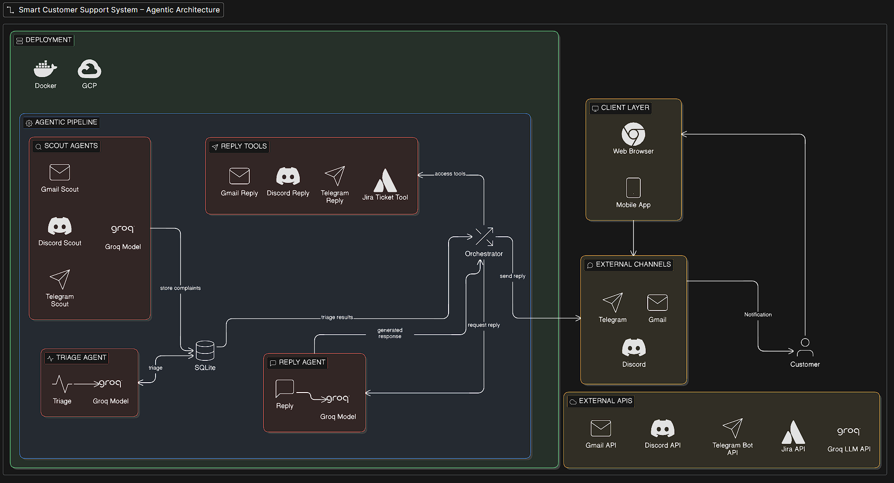

# 🤖 Smart Customer Support

An AI-powered multi-agent customer support system built with FastAPI and LangChain. It automatically processes customer complaints, triages issues, creates Jira tickets, and sends responses via Gmail, Discord, and Telegram.



## ✨ Features

- 📧 **Gmail Integration** - Automatically fetch and process customer emails
- 🎯 **AI Triage** - Classify and prioritize issues using LLM
- 🎫 **Jira Integration** - Auto-create tickets for tracked issues
- 💬 **Discord Notifications** - Send alerts to support channels
- 📱 **Telegram Bot** - Notify team via Telegram
- 🤖 **Smart Replies** - Generate AI-powered email responses
- 🐳 **Docker Ready** - Fully containerized for easy deployment

## 🏗️ Architecture

The system uses a multi-agent architecture:

| Agent | Description |
|-------|-------------|
| **Scout Agents** | Fetches and monitors incoming complaints/request |
| **Triage Agent** | Classifies priority and category of issues |
| **Reply Agent** | Generates professional email responses |


## 📁 Project Structure

```
smart_customer_support/
├── app/
│   ├── agents/
│   │   ├── tools/
│   │   │   ├── discord_tools.py
│   │   │   ├── jira_tools.py
│   │   │   ├── reply_tools.py
│   │   │   └── telegram_tools.py
│   │   ├── discord_agent.py
│   │   ├── gmail_agent.py
│   │   ├── reply_agent.py
│   │   ├── telegram_agent.py
│   │   └── triage_agent.py
│   ├── api/
│   │   └── email_handler.py
│   ├── config/
│   │   └── config.py
│   ├── services/
│   │   ├── discord_service.py
│   │   ├── gmail_service.py
│   │   ├── jira_service.py
│   │   └── telegram_service.py
│   ├── utils/
│   │   ├── jsonextract.py
│   │   └── logger.py
│   ├── background.py
│   ├── database.py
│   └── main.py
├── secrets/
│   ├── credentials.json
│   └── token.json
├── data/
├── .env
├── .gitignore
├── .dockerignore
├── Dockerfile
├── docker-compose.yml
├── pyproject.toml
└── README.md
```

## 🚀 Getting Started

### Prerequisites

- Python 3.12+
- [UV](https://github.com/astral-sh/uv) package manager
- Docker & Docker Compose (for containerized setup)
- Gmail API credentials
- Jira API token
- Discord Bot token
- Telegram Bot token

### Installation

#### Option 1: Local Development

1. **Clone the repository**
   ```bash
   git clone https://github.com/yourusername/smart_customer_support.git
   cd smart_customer_support
   ```

2. **Install UV** (if not already installed)
   ```bash
   curl -LsSf https://astral.sh/uv/install.sh | sh
   ```

3. **Create and Activate a Virtual Environment**
   ```bash
   # Create a virtual environment
   uv venv

   # Activate on Windows
   .\venv\Scripts\activate

   # Activate on macOS/Linux
   source venv/bin/activate
   ```

4. **Install dependencies**
   ```bash
   uv sync
   ```

5. **Set up environment variables**
   ```bash
   cp .env.example .env
   # Edit .env with your API keys
   ```
   or Create a .env file in the root directory.

6. **Set up Gmail OAuth credentials**
   - Go to [Google Cloud Console](https://console.cloud.google.com/)
   - Create OAuth 2.0 credentials
   - Download `credentials.json` and place in `secrets/` folder
   - Run the app once locally to generate `token.json`

7. **Run the application**
   ```bash
   uv run uvicorn app.main:app --reload
   ```

#### Option 2: Docker (Recommended for Production)

1. **Clone the repository**
   ```bash
   git clone https://github.com/yourusername/smart_customer_support.git
   cd smart_customer_support
   ```

2. **Set up environment variables**
   ```bash
   cp .env.example .env
   # Edit .env with your API keys
   ```

3. **Set up Gmail credentials**
   ```bash
   mkdir secrets
   # Add credentials.json and token.json to secrets/
   ```

4. **Create required directories**
   ```bash
   mkdir data
   touch app.log
   ```

5. **Build and run with Docker**
   ```bash
   docker-compose up --build -d
   ```

6. **View logs**
   ```bash
   docker-compose logs -f
   ```

## ⚙️ Environment Variables

Create a `.env` file in the root directory:

```env
# LLM API Keys
GROQ_API_KEY=your_groq_api_key
GEMINI_API_KEY=your_gemini_api_key

# Gmail OAuth (paths relative to project root)
GMAIL_CREDENTIALS_PATH=secrets/credentials.json
GMAIL_TOKEN_PATH=secrets/token.json

# Jira Configuration
JIRA_API_TOKEN=your_jira_api_token
JIRA_EMAIL=your_jira_email
JIRA_DOMAIN=your_domain.atlassian.net
JIRA_PROJECT_KEY=PROJECT

# Discord Configuration
DISCORD_BOT_TOKEN=your_discord_bot_token
DISCORD_SUPPORT_CHANNEL_ID=your_channel_id

# Telegram Configuration
TELEGRAM_BOT_TOKEN=your_telegram_bot_token

# Logging
LOG_LEVEL=INFO
LOG_FILE=app.log
```

## 🐳 Docker Commands

```bash
# Build and start
docker-compose up --build -d

# View logs
docker-compose logs -f

# Stop containers
docker-compose down

# Restart
docker-compose restart

# Enter container shell
docker exec -it smart-customer-support /bin/bash

# View app logs inside container
docker exec -it smart-customer-support cat app.log
```

## 🔧 Configuration

### Gmail OAuth Setup

1. Go to [Google Cloud Console](https://console.cloud.google.com/)
2. Create a new project or select existing
3. Enable Gmail API
4. Create OAuth 2.0 credentials (Desktop App)
5. Download JSON and save as `secrets/credentials.json`
6. Run locally first to complete OAuth flow and generate `token.json`

### Jira Setup

1. Generate API token at [Atlassian Account](https://id.atlassian.com/manage-profile/security/api-tokens)
2. Add token, email, and domain to `.env`

### Discord Setup

1. Create bot at [Discord Developer Portal](https://discord.com/developers/applications)
2. Get bot token and channel ID
3. Add to `.env`

### Telegram Setup

1. Create bot via [@BotFather](https://t.me/botfather)
2. Get bot token
3. Add to `.env`


## 📝 Logging

Logs are written to `app.log` in the root directory. In Docker, this file is persisted via volume mount.

```bash
# View logs locally
cat app.log

# View logs in Docker
docker exec -it smart-customer-support cat app.log

# Tail logs
tail -f app.log
```

## 🤝 Contributing

1. Fork the repository
2. Create a feature branch (`git checkout -b feature/amazing-feature`)
3. Commit your changes (`git commit -m 'Add amazing feature'`)
4. Push to the branch (`git push origin feature/amazing-feature`)
5. Open a Pull Request

## 🙏 Acknowledgments

- [LangChain](https://langchain.com/) - LLM framework
- [FastAPI](https://fastapi.tiangolo.com/) - Web framework
- [UV](https://github.com/astral-sh/uv) - Package manager
- [Groq](https://groq.com/) - LLM inference

