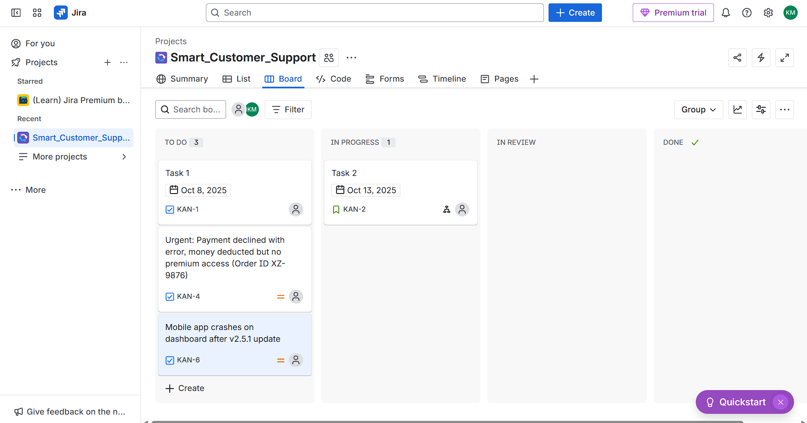
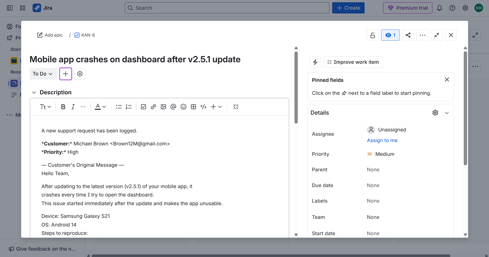
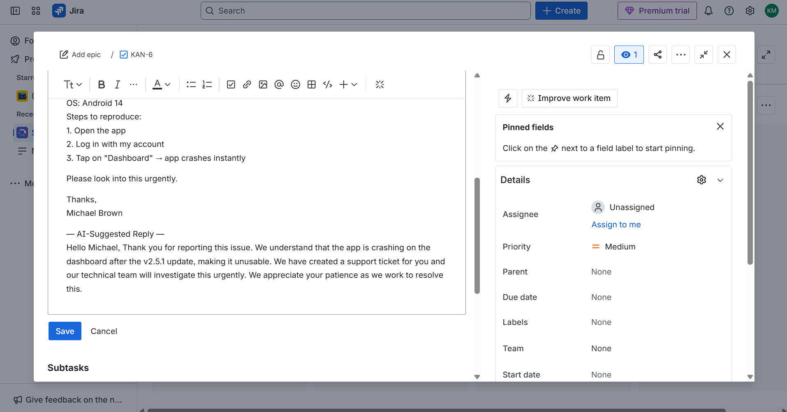

# Smart Customer Support Automation

An **AI-powered, multi-agent application** that automates customer support workflows. This system uses a **Scout Agent** to monitor a Gmail inbox, a **Triage Agent** to analyze and decide on actions, and an **Orchestrator** to execute tasks like creating Jira tickets or sending replies.

Built with **Python**, **FastAPI**, and **LangChain**, this project demonstrates a robust, scalable producer-consumer architecture for handling real-world support automation.

---

## 🏛️ Architecture

The system uses a queue-based, multi-agent workflow to decouple tasks and ensure reliable processing.

```
┌──────────────────────┐      ┌─────────────────┐      ┌───────────────────┐
│                      │      │                 │      │                   │
│  Gmail Scout Agent   ├─────►│  Support Queue  ├─────►│  Orchestrator     │
│  (Finds new emails)  │      │ (FIFO Buffer)   │      │  (Processes items)│
│                      │      │                 │      │                   │
└──────────────────────┘      └─────────────────┘      └─────────┬─────────┘
                                                                │
                                           ┌────────────────────▼───────────────────┐
                                           │                                        │
                                           │  1. Use Triage Agent to make decision  │
                                           │  2. Execute decision with Tools        │
                                           │                                        │
                                           └────────────────────┬───────────────────┘
                                                                │
                                     ┌──────────────────────────┴──────────────────────────┐
                                     │                                                     │
                             ┌───────▼───────┐                                     ┌───────▼───────┐
                             │               │                                     │               │
                             │ Jira Tool     │                                     │ Reply Tool    │
                             │(Create Ticket)│                                     │(Send Email)   │
                             │               │                                     │               │
                             └───────────────┘                                     └───────────────┘
```

---

## 🚀 Features

-   **Agentic Workflow**: Utilizes specialized LangChain agents for distinct tasks: a `Scout Agent` for discovery and a `Triage Agent` for decision-making.
-   **Intelligent Triage**: The Triage Agent analyzes email content to determine priority (`High`, `Normal`) and the best action (`CREATE_TICKET` or `SEND_REPLY`).
-   **Tool-Based Execution**: The orchestrator uses specific, reliable tools to interact with external services like Jira and Gmail, ensuring predictable outcomes.
-   **AI-Generated Acknowledgments**: For ticket creation, a separate LLM call generates a context-aware, empathetic acknowledgment email for the customer.
-   **Scalable Queue System**: Built on an async queue, allowing the system to handle backpressure and be easily extended with new channels (e.g., Discord, Telegram).
-   **Robust Logging**: Logs all agent actions, orchestrator decisions, and errors to both the console and a persistent `app.log` file.

---

## ✨ Showcase: Jira Integration

The system identifies high-priority emails and automatically creates detailed tickets on the Jira board.


Each ticket contains the full context needed for a human agent to take over, including the original customer message.


For tickets requiring a human touch, the system can even suggest a reply, which can be included in the ticket description.


---

## 🛠 Tech Stack

-   **Backend**: Python, FastAPI, Uvicorn
-   **Agent Framework**: LangChain, LangChain Agents
-   **AI / LLM**: Google Gemini 2.5 Flash (via `langchain-google-genai`)
-   **Integrations & Tools**:
    -   **Gmail**: `langchain-google-community[gmail]` for the Scout Agent's tools.
    -   **Jira**: `jira` library for the ticket creation tool.
    -   **Discord**: `discord.py` for potential future channel integration.

---

## 📦 Setup and Installation

### 1. Clone the Repository

```bash
git clone <your-repository-url>
cd smart-customer-support
```

### 2. Create and Activate a Virtual Environment

```bash
# Create a virtual environment
python -m venv venv

# Activate on Windows
.\venv\Scripts\activate

# Activate on macOS/Linux
source venv/bin/activate
```

### 3. Install Dependencies

```bash
pip install -r requirements.txt
```

### 4. Configure Credentials

-   **Google API**:
    -   Follow the Google Cloud documentation to create an **OAuth 2.0 Client ID**.
    -   Download the `credentials.json` file and place it in the project's root directory.
-   **Environment Variables**:
    -   Create a `.env` file in the root directory.
    -   Copy and paste the following, filling in your own secret values.

    ```env
    # .env

    # Google
    GMAIL_CREDENTIALS_PATH=credentials.json
    GEMINI_API_KEY="your_gemini_api_key"

    # Jira
    JIRA_API_TOKEN="your_jira_api_token"
    JIRA_EMAIL="your-jira-login-email@example.com"
    JIRA_DOMAIN="your-domain.atlassian.net"
    JIRA_PROJECT_KEY="YOUR_PROJECT_KEY"

    # Discord (for future use)
    DISCORD_BOT_TOKEN="your_discord_bot_token"
    DISCORD_SUPPORT_CHANNEL_ID="your_discord_channel_id"
    ```

-   **Gmail Token**: A `token.json` file will be automatically created in the root directory the first time you run the application, after you complete the browser-based authentication flow.

---

## ▶️ Running the Application

Start the FastAPI server with Uvicorn. The `--reload` flag will automatically restart the server when you make code changes.

```bash
uvicorn app.main:app --reload
```

Once running, the application will:
1.  Start the FastAPI server on `http://127.0.0.1:8000`.
2.  Launch the background tasks for the `gmail_listener` and `orchestrator`.
3.  Begin logging all activities to the console and `app.log`.

